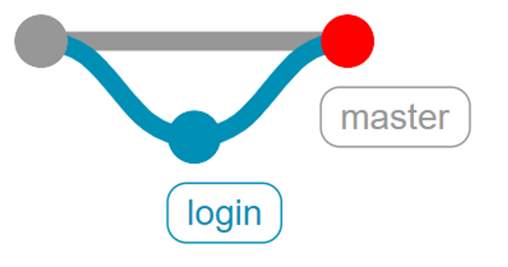
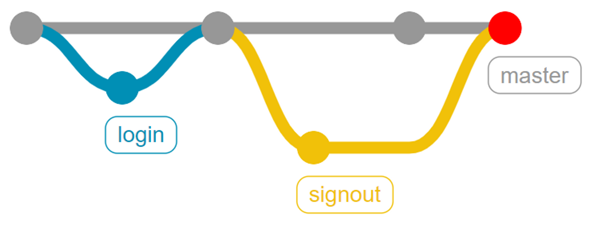
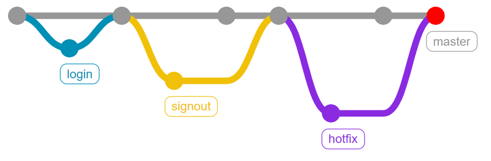

# TIL DAY 02
> 2022년 12월 27일

>## 원격 저장소에서 가져오기
>`git clone`, `git pull`
### (1) git clone
- 원격 저장소의 commit을 가져온 후, Local 저장소를 생성하는 명령어
- `git clone` 명령어로 원격저장소를 전부 복사하여 내 컴퓨터(Local)로 옮길 수 있다.
- `git clone <원격 저장소 주소>`
- git clone을 하면 `git init` 과 `git remote add`는 이미 포함하고 있으므로 추가로 실행할 필요 없다.


```bash
$ git clone (주소)
Cloning into 'TIL'...
remote: Enumerating objects: 3, done.
remote: Counting objects: 100% (3/3), done.
remote: Total 3 (delta 0), reused 3 (delta 0), pack-reused 0
Receiving objects: 100% (3/3), done.
```
KimKiGUN Github의 TIL 원격 저장소를 복제하여 내 컴퓨터에 TIL이라는 이름의 로컬 저장소를 생성하게 된다.


### (2) git pull
- 원격 저장소의 **변경사항**을 가져와서 Local 저장소를 업데이트하는 명령어
- `git clone` 과 비교! 
- `git clone`은 Local 전체를, `git pull`은 변경사항만 저장
- `git pull <원격 저장소 주소> <Branch주소>` 로 입력한다.

```bash
$ git pull origin master
From https://github.com/edukyle/git-practice
 * branch            master     -> FETCH_HEAD
Updating 6570ecb..56809a9
Fast-forward
 README.md | 1 +
 1 file changed, 1 insertion(+)
``` 
git push를 사용하여 origin 원격 저장소에서 master branch 내용을 가져온다.

### (3) 주의사항 ##
`git clone`은 처음에 한 번만 사용
Github에서 저장소를 복제해서 내 컴퓨터에 **처음 복제본을 만드는 것으로 생각**

`git pull`은 원격저장소의 변경사항을 
내 컴퓨터에 반영하는것.(내용 동기화)
  
  ***

>## .gitgnore
> 특정 파일, 폴더에 Git이 버전관리 못하도록 지정하는 것을 말한다

### (1) gitgnore 대상
- 개인정보(전화번호, 비밀번호, 비밀 등)
- OS(운영체제) 관련 파일
- IDE 혹은 Text editor 활용 파일
- 개발언어(python) 혹은 프레임워크(django)에서 사용되는 파일

### (2) gitgnore 주의사항
- 반드시 이름을 `.gitignore`로 작성한다.
- `.gitignore` 파일은 `.git` 폴더와 동일위치에 만든다.
- 제외하고 싶은 파일은 반드시 `git add` 전에 `.gitignore`에 작성한다.
  (git add 후에 gitignore 해도 무시됨)

### (3) gitgnore 작성
- 주로 [웹사이트](https://www.toptal.com/developers/gitignore/) 또는 [gitignore Github](https://github.com/github/gitignore) 이용하여 작성.
### (4) gitgnore 패턴예시
- #로 시작하는 라인은 무시.
- `슬래시(/)`로 시작하면 하위 디렉토리에 적용되지 않음.
- 디렉토리는 `슬래시(/)` 를 끝에 사용한다
- `느낌표(!)` 로 시작하는 패턴의 파일은 ignore 하지 않는다.
- `*(asterisk)`는 문자를 의미.
- `[abc]` 는 중괄호 안에 있는 문자 중 하나를 의미.
- `물음표(?)` 는 문자 하나를 의미.
- `**(2 asterisk)` 는 디렉토리 내부의 디렉토리까지 지정함을 의미.
  
```bash

# .gitignore


# 확장자가 txt인 파일 무시
*.txt

# 현재 확장자가 txt인 파일이 무시되지만, 느낌표를 사용하여 test.txt는 무시하지 않음
!test.txt

# 현재 디렉터리에 있는 TODO 파일은 무시하고, folder/TODO 처럼 하위 디렉터리에 있는 파일은 무시하지 않음
/TODO

# build/ 디렉터리에 있는 모든 파일은 무시
build/

# folder/notes.txt 파일은 무시하고 folder/child/arch.txt 파일은 무시하지 않음
folder/*.txt

# folder 디렉터리 아래의 모든 .pdf 파일을 무시
folder/**/*.pdf
```
***

>## Branch
> 나뭇가지처럼 여러 갈래로 작업공간을 나누어 독립적으로 작업할 수 있도록 하는 Git 도구

- Branch 는 독립 공간을 만든 후에 작업하므로 원본(master)에 대해 안전하다.
- 분업적으로 체계적인 개발이 가능하다.
- 원본(master)에 영향을 끼치지 않고 문제 해결, 버전 업데이트 등을 함.

### (1) git branch
```bash
# 브랜치 목록 확인
$ git branch

# 원격 저장소의 브랜치 목록 확인
$ git branch -r

# 새로운 브랜치 생성
$ git branch <브랜치 이름>

# 특정 커밋 기준으로 브랜치 생성
$ git branch <브랜치 이름> <커밋 ID>

# 특정 브랜치 삭제
$ git branch -d <브랜치 이름> # 병합된 브랜치만 삭제 가능
$ git branch -D <브랜치 이름> # (주의) 강제 삭제 (병합되지 않은 브랜치도 삭제 가능)
```
### (2) git switch
- 현재 branch 에서 다른 branch 로 `HEAD`를 이동시키는 명령어.
- `HEAD`란 현재 branch를 가리키는 포인터를 말함.
- branch 이동하기 전에 꼭 `commit` 할 것!!
- `$ git log --oneline --graph --all`로 branch 확인.
```bash
# 다른 브랜치로 이동
$ git switch <다른 브랜치 이름>

# 브랜치를 새로 생성과 동시에 이동
$ git switch -c <브랜치 이름>

# 특정 커밋 기준으로 브랜치 생성과 동시에 이동
$ git switch -c <브랜치 이름> <커밋 ID>
```
***

>## Branch-merge
> 각 branch에서 독립적으로 작업한 내용을 원본?(master)에 반영하기 위해 합치는 과정

### (1) git merge
- 나눠진 branch 들을 하나로 합치는 명령어
- `git merge <합할 branch 이름>`의 형태로 사용
- **`git merge` 하기 전에 메인 branch 로 switch 해야함!**
```bash
# 1. 현재 branch1과 branch2가 있고, HEAD가 가리키는 곳은 branch1 입니다.
$ git branch
* branch1
  branch2

# 2. branch2를 branch1에 합치려면?
$ git merge branch2

# 3. branch1을 branch2에 합치려면?
$ git switch branch2
$ git merge branch1
```
### (2) Merge의 종류
1. Fast-Forward


```bash
# login 브랜치 생성 및 이동

$ git switch -c login

# 작업 후 commit

$ touch login.txt
$ git add .
$ git commit -m "login test 1"

# master 브랜치로 이동

$ git switch master

$ git log --oneline --all --graph
* df231d0 (login) login test 1
* 1e62b4c (HEAD -> master) master test 1

# master에 login 을 merge

$ git merge login
Updating 1e62b4c..df231d0
Fast-forward
 login.txt | 0
 1 file changed, 0 insertions(+), 0 deletions(-)
 create mode 100644 login.txt

$ git log --oneline --all --graph
* df231d0 (HEAD -> master, login) login test 1
* 1e62b4c master test 1

# login 브랜치 삭제

$ git branch -d login
Deleted branch login (was df231d0).

$ git log --oneline --all --graph
* df231d0 (HEAD -> master) login test 1
* 1e62b4c master test 1
```

2. 3-way Merge


```bash
# signout 브랜치 생성 및 이동

$ git switch -c signout

# 특정 작업 후 commit

$ touch signout.txt

$ git add .
$ git commit -m "signout test 1"

$ git log --oneline
bcade83 (HEAD -> signout) signout test 1
df231d0 (master) login test 1
1e62b4c master test 1

# master branch 이동

$ git switch master

# master 에 추가 작업 후 commit (signout 브랜치와 다른 파일 생성, 수정)

$ touch master.txt

$ git add .
$ git commit -m "master test 2"

$ git log --all --oneline
48bd5a6 (HEAD -> master) master test 2
bcade83 (signout) signout test 1
df231d0 login test 1
1e62b4c master test 1

# master 에 signout 병합 (자동 merge)

$ git merge signout
Merge made by the 'ort' strategy.
 signout.txt | 0
 1 file changed, 0 insertions(+), 0 deletions(-)
 create mode 100644 signout.txt

# log 확인

 $ git log --oneline --all --graph
*   ac0e971 (HEAD -> master) Merge branch 'signout'
|\
| * bcade83 (signout) signout test 1
* | 48bd5a6 master test 2
|/
* df231d0 login test 1
* 1e62b4c master test 1

# sign out 브랜치 삭제

$ git branch -d signout
Deleted branch signout (was bcade83).

```
3. Merge Conflict


```bash
# hotfix 브랜치 생성 및 이동
$ git switch -c hotfix

# test.txt 수정후 commit(hotfix에서 작성한 문장)

master test 1

$ git add .
$ git commit -m "hotfix test 1"

$ git log --oneline --graph --all
* ad045fa (HEAD -> hotfix) hotfix test 1
*   ac0e971 (master) Merge branch 'signout'
|\
| * bcade83 signout test 1
* | 48bd5a6 master test 2
|/
* df231d0 login test 1
* 1e62b4c master test 1

# master branch 이동

$ git switch master

# text.txt 수정(hotfix와 동일 파일의 동일 부분을 master1에서 작성 후 commit)

master test 1

$ git add .
$ git commit -m "master test 3"

$ git log --oneline --all --graph
* 3170247 (HEAD -> master) master test 3
| * ad045fa (hotfix) hotfix test 1
|/
*   ac0e971 Merge branch 'signout'
|\
| * bcade83 signout test 1
* | 48bd5a6 master test 2
|/
* df231d0 login test 1
* 1e62b4c master test 1

# master에 hotfix merge

$ git merge hotfix

```
- Merge conlict 발생!! (같은 파일의 같은 위치 문장을 수정하여서 생긴 conflict)
- `Accept Current Change`, `Accept Incoming Change`, `Accept Both Changes`에서 골라서 해결

```bash
#log 확인
$ git log --oneline --all --graph
*   8ef1443 (HEAD -> master) Merge branch 'hotfix'
|\
| * ad045fa (hotfix) hotfix test 1
* | 3170247 master test 3
|/
*   ac0e971 Merge branch 'signout'
|\
| * bcade83 signout test 1
* | 48bd5a6 master test 2
|/
* df231d0 login test 1
* 1e62b4c master test 1
```
